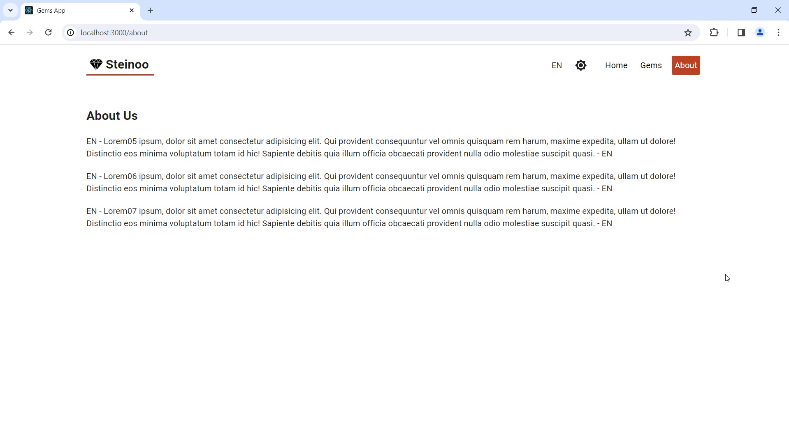
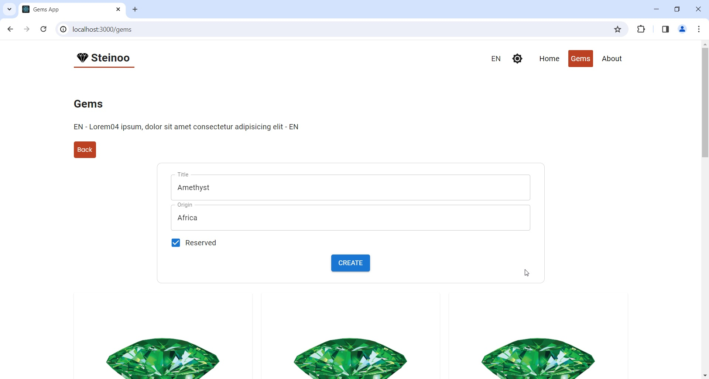

# Gems Full Stack App

## Description

*	Backend
    *	Mongo DB
    *	Spring Boot
      
*	Frontend
    *	React

In this project i wanted to put my all Web Developing knowledge which i learned in last two years together (HTML, CSS, JavaScript, Java, React, Spring Boot). I created a small Gems App, which should be use in a future as a store for selling the gemstones. Currently is in a test phase, all texts are generated only through the Lorem (HTML – generate random text). App read the current records from Mongo DB, through app it´s then possibly create / edit / delete gem records. For test purposes can be added maximal 11 records (Warning popup, will be shown). The frontend part can be found on the link xxxxxx. It´s running on AWS EC2 compute node. 

* MAIN PAGES
  
   * HOME
      
     

  * GEMS
    
      

  * ABOUT
    
      

  * CHANGE MODE
    
      

  * CHANGE LANGUAGE
    
      

With this project I learned how to put together Frontend and Backend, also was my first experience with Spring Boot. I would like to add in the app more features like:
  * Authentication
      * for login possibility

  * Add cart
      * Gems should be bought online

## Table of Contents

- [Installation](#installation)
- [Usage](#usage)
- [License](#license)

## Installation

### Backend
* Mongodb
    * Mongodb have to be installed
        * https://www.mongodb.com/docs/manual/installation/

    * After installation have to be imported test gems records to the database
        * Database: gems_db
        * Collection: gems

* Spring Boot
    * Have to be generated initial config for project
        * https://start.spring.io/
        * Screen

    * IntellijIDEA
        * import Backend part from Github
            * https://github.com/Jozefcvik/GemsAppFullstack_Mongo_Spring_React/tree/main/gemsAppBackendSpring
                * src/main
                * pom.xml

    * After import start the application
    * The data from Mongo database could be seen:
          * http://localhost:8080/api/v1/gems

### Frontend

* React
  * From Github copy frontend part to some folder
    * https://github.com/Jozefcvik/GemsAppFullstack_Mongo_Spring_React/tree/main/gemsAppFrontendReact
  * After import open the folder with Visual Studio
  * In Terminal execute command:
    * init install
    * the command installs a package and any packages that it depends on
  * After that we can execute the application:
    * npm start

## Usage

### Create Record

For testing purposes can be added maximal 11 records. If it will be tried to add more records, the warning popup will be shown up.

### Edit Record

### Delete Record

## License

### MIT License

Copyright (c) 2024 Jozef Cvik

Permission is hereby granted, free of charge, to any person obtaining a copy
of this software and associated documentation files (the "Software"), to deal
in the Software without restriction, including without limitation the rights
to use, copy, modify, merge, publish, distribute, sublicense, and/or sell
copies of the Software, and to permit persons to whom the Software is
furnished to do so, subject to the following conditions:

The above copyright notice and this permission notice shall be included in all
copies or substantial portions of the Software.

THE SOFTWARE IS PROVIDED "AS IS", WITHOUT WARRANTY OF ANY KIND, EXPRESS OR
IMPLIED, INCLUDING BUT NOT LIMITED TO THE WARRANTIES OF MERCHANTABILITY,
FITNESS FOR A PARTICULAR PURPOSE AND NONINFRINGEMENT. IN NO EVENT SHALL THE
AUTHORS OR COPYRIGHT HOLDERS BE LIABLE FOR ANY CLAIM, DAMAGES OR OTHER
LIABILITY, WHETHER IN AN ACTION OF CONTRACT, TORT OR OTHERWISE, ARISING FROM,
OUT OF OR IN CONNECTION WITH THE SOFTWARE OR THE USE OR OTHER DEALINGS IN THE
SOFTWARE.
